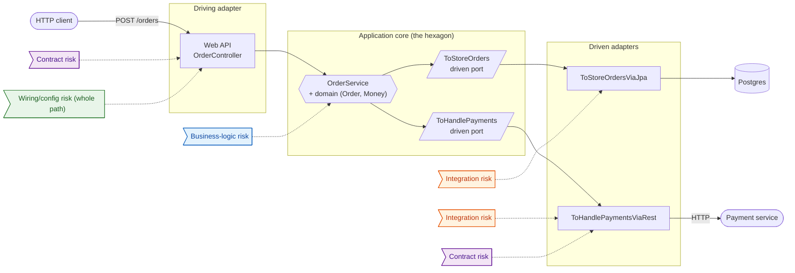

# Testing Hexagonal Architecture by Risk

[](https://sonarcloud.io/summary/new_code?id=mkutz_hexagonal-testing-spring-boot)

Most articles about testing hexagonal architecture start with the architecture and bolt the tests on afterward.
This one starts somewhere else: with the risks.
Every test you write should exist to mitigate a specific risk, at the _cheapest_ layer that can credibly mitigate it.
If a test doesn't reduce a real risk, it's just a maintenance liability wearing a green checkmark!

Two influences shape this approach.
The first is James Shore's [*Testing Without Mocks* pattern language][testing-without-mocks] – the preference for sociable, state-based tests over mock-heavy interaction tests, and the use of in-memory fakes instead of mocking frameworks.
The second is Richard Bradshaw's [TRIMS heuristic][trims], which is where the risk-based framing comes from.
TRIMS stands for Targeted, Reliable, Informative, Maintainable, and Speedy – and its very first principle is the one this whole article is built on: a check should be targeted to a specific risk and automated on the lowest layer the testability allows.

The approach diverges from Shore on one deliberate point.
Shore's stated goal is to write unit tests so thorough that *no* integration tests are needed.
I keep an integration layer, because I want real infrastructure to prove that the integration risk is actually mitigated, not assumed away.
The testing pyramid stays intact.
We just make sure every layer of it is earning its place – which is exactly what TRIMS asks of us.

<a id="part-1"></a>

## Part 1: The Risks

Before a single test, name what can go wrong.
A worthwhile note on the division of labor here: [TRIMS] deliberately is *not* a heuristic for finding risks – Bradshaw is explicit that it exists to question the value of what you automate, and points to [Karen Johnson's RCRCRC][rcrcrc] (Recent, Core, Risky, Configuration-sensitive, Repaired, Chronic) as the heuristic for *identifying* what to test.
The two compose neatly: [RCRCRC] helps you enumerate the risks, TRIMS helps you place a check against each one.
The list below is the identification step; everything after it is placement.

A Spring Boot backend application that supports a business carries roughly these categories of risk:

1. **Business-logic risks.**
   The domain rules are wrong, edge cases are mishandled, invariants can be violated, or a calculation is subtly off.
   This is the risk that the software does the wrong thing even when everything is wired correctly.
   It is also the risk with the largest number of distinct cases, because it's where equivalence classes and boundaries live.

2. **Integration risks.**
   The core is correct, but the adapter that talks to the outside world isn't.
   The ORM mapping is wrong, the SQL doesn't run on the real dialect, a transaction boundary is misplaced, a JSON field serializes under the wrong name, a Kafka topic is misconfigured, or a `@Transactional` annotation silently does nothing because of self-invocation.
   These bugs are invisible to any test that doesn't touch real infrastructure.

3. **Contract risks.**
   The application talks to other systems through interfaces – HTTP endpoints it exposes, events it publishes, payloads it consumes.
   The risk is that one of these contracts changes without anyone intending it to, breaking a consumer you can't see from inside this codebase.

4. **Wiring and configuration risks.**
   Spring's dependency injection, profiles, properties, and auto-configuration are correct in isolation but wrong in combination.
   A bean isn't found, a profile loads the wrong implementation, a property isn't bound, the context simply fails to start.

5. **Operational risks.**
   Performance under load, observability, graceful failure handling, resource leaks.
   Important, but largely outside the scope of functional testing – I name them here so we're honest that the pyramid below does *not* cover them, and they need their own treatment.

Note that there are more risks involved as soon as we talk about an application with a frontend.
I deliberately ignore these in this article.

To make this concrete, the rest of the article tests one small example: a service that **places customer orders against a credit limit**.
Its business rules are the kind of thing a product owner would recognize, not a programmer – they hold no matter how the code is written:

- An order is accepted only if its amount is within the customer's **credit limit**; otherwise it is rejected.
- An accepted order **charges the customer exactly the order amount** – never more, never less.
- A rejected order **leaves no trace**: nothing stored, nothing charged.
- Money must stay **exact** – amounts are tracked in minor units (cents) so there is no rounding drift and no half-cent surprises.

These are the **business-logic risks** from the list above, made specific.
Notice that none of them mention Spring, HTTP, or SQL – they are claims about behavior the business cares about, which is exactly why they belong in fast tests close to the core ([Part 2][part-2]).

The thesis of the rest of this article: **each risk should be mitigated at the lowest layer of the pyramid that can credibly address it, and once a risk is mitigated at a low layer, the higher layers should not re-test it.**
The higher layers verify *wiring*, not *logic*.

This is the **Targeted** principle of [TRIMS] made concrete.
Bradshaw's heuristic frames it as *think risk, think seam, think testability*: pick the risk, then place the check on the lowest seam where the testability of the system lets you mitigate it.
Hexagonal architecture can give us that testability – the ports are clean seams that let us push most checks down to the fast unit layer instead of forcing everything through the slow, assembled application.
But the same principles (with a little more effort) can be applied to a layered architecture or other concentric architectures as well.

The remaining four letters of [TRIMS] shape *how* each test is written rather than *where* it sits, and they recur throughout what follows.

- **Reliable**:
  tests must be deterministic, which is the entire reason the [shared-context caveat][shared-context] obsesses over test pollution.
- **Informative**:
  a failing test should point at what changed – which is why approval tests ([Part 5][part-5]) capture whole contract shapes, and why state-based assertions beat interaction assertions.
- **Maintainable**:
  few, well-placed tests are cheaper to keep alive than many redundant ones.
- **Speedy**:
  a single reused context and a thin top of the pyramid are what keep the suite fast enough for rapid feedback. Each layer below is chosen with all five letters in mind.

## The Hexagon, and Where the Risks Live

The example in this repository is deliberately small: one **driving** adapter (a web API) and two **driven** adapters (an HTTP payment gateway and JPA persistence).
That is enough to place every risk on the map.
Each badge below marks where a risk class actually lives; the color matches the table that follows.



Read the diagram as the risk-to-layer thesis made visual: each risk is mitigated at the lowest seam that can credibly address it, and nowhere else.

|             Risk              |                                   Where it lives in the diagram                                    |           Lowest layer that mitigates it            |
|-------------------------------|----------------------------------------------------------------------------------------------------|-----------------------------------------------------|
| 🔵 **Business-logic**         | the core – `OrderService` and the domain model                                                     | Unit tests ([Part 2][part-2])                       |
| 🟠 **Integration**            | each driven adapter where it meets real infrastructure – JPA ↔ Postgres, RestClient ↔ payment HTTP | Driven-adapter integration tests ([Part 3][part-3]) |
| 🟢 **Wiring & configuration** | the whole assembled path: driving adapter → core → driven adapters (Spring wires it together)      | End-to-end test ([Part 4][part-4])                  |
| 🟣 **Contract**               | the interfaces crossing the boundary – the web response shape, the payment request payload         | Approval tests ([Part 5][part-5])                   |
| ⚪ **Operational**             | the running system as a whole – load, observability, failure handling                              | Out of scope here ([Part 1][part-1])                |

The rest of the article walks down this table, one risk at a time.

<a id="part-2"></a>

## Part 2: Unit Tests – the Core Behind Its Ports

Hexagonal architecture – the [Ports and Adapters][ports-and-adapters] pattern coined by Alistair Cockburn, and explained at length in his book [*Hexagonal Architecture Explained*][hexagonal-architecture-explained] – gives us a precise boundary for unit testing: the ports.
The application core depends only on port interfaces.
It has no idea whether a port is backed by Postgres, an HTTP call, or a hash map. That ignorance is exactly what makes the core cheap to test.

For unit tests, I replace each port with a hand-written in-memory fake.
E.g. a repository port backed by Postgres in production becomes a wrapped `HashMap` in the test.

```kotlin
interface ToStoreOrders {
  fun save(order: Order)

  fun findById(id: OrderId): Order?
}

class ToStoreOrdersInMemory : ToStoreOrders {

  private val store = ConcurrentHashMap<OrderId, Order>()

  override fun save(order: Order) {
    store[order.id] = order
  }

  override fun findById(id: OrderId): Order? = store[id]
}
```

> 📄 Source: [`ToStoreOrders.kt`][ToStoreOrders.kt] · [`ToStoreOrdersInMemory.kt`][ToStoreOrdersInMemory.kt] – the snippets below are taken verbatim from this repository's Kotlin sources, trimmed to the relevant excerpt and without the package and import lines.

The core's use case is then tested directly, with no Spring context, no mocking framework, and no infrastructure:

```kotlin
class PlaceOrderTest {

  private val orderStore = ToStoreOrdersInMemory()
  private val paymentHandler = ToHandlePaymentsInMemory()
  private val orderService = OrderService(orderStore, paymentHandler)

  @Test
  fun `placing an order below the credit limit succeeds`() {
    val customer = CustomerId.random()
    paymentHandler.setCreditLimit(customer, Money.euros(100))

    val result = orderService.handle(aPlaceOrderCommand(customer, Money.euros(80)))

    assertThat(result).isInstanceOf(OrderPlaced::class.java)
    assertThat(orderStore.findById((result as OrderPlaced).orderId)).isNotNull()
  }

  @Test
  fun `placing an order well above the credit limit is rejected and persists nothing`() {
    val customer = CustomerId.random()
    paymentHandler.setCreditLimit(customer, Money.euros(100))

    val result = orderService.handle(aPlaceOrderCommand(customer, Money.euros(120)))

    assertThat(result).isInstanceOf(OrderRejected::class.java)
    assertThat(paymentHandler.chargesFor(customer)).isEmpty()
  }
}
```

> 📄 Source: [`PlaceOrderTest.kt`][PlaceOrderTest.kt]

These are state-based tests: they assert on returned values and on the resulting state of the fakes, never on which methods were called.
This is the heart of the mockless style.
A mock would let you assert that `payments.charge()` was called; it would not tell you whether charging the *right amount* leaves the system in the *right state*.
The fake does.

**This layer mitigates business-logic risk, and it does so exhaustively.**
Every equivalence class and every boundary belongs here: the order exactly at the credit limit, one cent below, one cent above, zero, negative, the maximum representable amount.
These tests are fast (milliseconds), so you can afford dozens of them per use case.
This exhaustiveness is the load-bearing claim of the whole strategy, because it's what lets every higher layer stay small.

### The objection: do fakes lie?

The standard rebuttal to in-memory fakes is that they can drift from the real adapter's behavior, so your green unit tests prove nothing about production.
This is a real risk, and it must be addressed, not waved away.
The answer is a **shared contract test suite**: an abstract test class that encodes the behavior every implementation of the port must satisfy, run against both the fake and the real adapter.

```kotlin
abstract class ToStoreOrdersContract {

  protected abstract fun store(): ToStoreOrders

  @Test
  fun `saved order can be retrieved by id`() {
    val order = anOrder()
    store().save(order)
    assertThat(store().findById(order.id)).isEqualTo(order)
  }

  @Test
  fun `unknown id returns null`() {
    assertThat(store().findById(OrderId(UUID.randomUUID()))).isNull()
  }
}
```

> 📄 Source: [`ToStoreOrdersContract.kt`][ToStoreOrdersContract.kt]
>
> **Side note – test data builders.**
> The `anOrder()` helper above is a *test data builder*: a factory function whose defaults are valid, random values, so each test overrides only the field it cares about – `anOrder(amount = Money.euros(120))`.
> It keeps setup to a minimum (the **Maintainable** of TRIMS) and centralizes the random-ID discipline that the [shared-context caveat][shared-context] leans on, in one place that feeds every layer.
> In Kotlin a default-argument factory is all a builder needs to be – no fluent `Builder().with…().build()` ceremony. Source: [`TestData.kt`][TestData.kt].

The in-memory implementation runs this contract as a plain unit test; the JPA implementation runs the *same* contract against Testcontainers ([Part 3][part-3]). If the fake and the real adapter disagree about the contract, one of the two suites goes red. That's the mechanism that keeps the fakes honest.

<a id="part-3"></a>

## Part 3: Driven-Adapter Integration Tests – Real Infrastructure, Few Cases

Driven adapters implement output ports: the JPA repository, the Kafka publisher, the HTTP client to a third-party service.
Here the risk shifts entirely.
The logic is already tested.
What we don't yet know is whether the adapter correctly *talks to real infrastructure* and if our wiring with the framework will work.

So these tests use a `@SpringBootTest` context and replace the external infrastructure with **[Testcontainers]** – a real Postgres, a real Kafka broker, in a container.
[Testcontainers] is as close to production as you can get without a permanently provisioned test environment, and it runs identically on a developer's laptop and in CI.

I use a single shared application context across all integration tests.
Spinning up a context is expensive; reusing one is the difference between a test suite that runs in a minute and one that runs in twenty.

> [!NOTE]
> Spring's TestContext framework [caches and reuses the context][spring-context-caching] across tests as long as its configuration stays identical.
> So keeping every integration test on the same setup is what lets it hand back the same cached context instead of building a new one.
> This might well not be the best choice in your case, but I'd encourage you to try this approach instead of starting with [sliced test contexts][spring-test-slices].

```kotlin
@SpringBootTest(webEnvironment = RANDOM_PORT)
@Import(TestcontainersConfiguration::class)
class ToStoreOrdersViaJpaIntegrationTest : ToStoreOrdersContract() {

  @Autowired private lateinit var store: ToStoreOrders

  @Autowired private lateinit var jdbcTemplate: JdbcTemplate

  override fun store(): ToStoreOrders = store

  @Test
  fun `persists money as minor units in the expected column`() {
    val order = anOrderOf(Money.euros(80))
    store.save(order)

    val amountMinor =
      jdbcTemplate.queryForObject(
        "SELECT amount_minor FROM orders WHERE id = ?",
        Long::class.java,
        order.id.value,
      )

    assertThat(amountMinor).isEqualTo(8000L)
  }
}
```

> 📄 Source: [`ToStoreOrdersViaJpaIntegrationTest.kt`][ToStoreOrdersViaJpaIntegrationTest.kt].
>
> `@Import(TestcontainersConfiguration::class)` pulls in the shared Testcontainers-Postgres and WireMock beans ([`TestcontainersConfiguration.kt`][TestcontainersConfiguration.kt]).
> Because every integration test carries this exact `@SpringBootTest` + `@Import` pair, Spring reuses a single cached context across the whole suite.

Two things to notice.
First, the class extends the same [`ToStoreOrdersContract`][ToStoreOrdersContract.kt] from [Part 2][part-2] – the real adapter must satisfy the exact behavior the fake promised.
Second, the one bespoke test checks something only real infrastructure can reveal: that money lands in the right column in the right representation.
That's an integration risk, and nothing below this layer could have caught it.

**The number of cases here is small, by design.**
I do not re-test the credit-limit boundaries; those were exhausted in the unit tests, and the adapter has no opinion about credit limits.
I test the contract (via the shared suite) plus the handful of things that are genuinely about the integration: mapping correctness, dialect-specific SQL, serialization, transaction behavior.
One happy path, _one_ unhappy representative, and a few integration-specific cases per adapter are usually enough.
**This is the payoff of doing boundary and equivalence testing at the unit layer: the integration layer only has to prove the wiring, so it stays thin.**

For a Kafka publisher the shape is the same – a `KafkaContainer`, the real publisher injected, and an assertion that a published event actually lands on the topic in the expected serialized form.

<a id="part-4"></a>

## Part 4: Driving-Adapter Tests – the Whole Application End to End

Driving adapters implement the inbound side: REST controllers, Kafka consumers, scheduled jobs.
In principle, you could test a controller in isolation.
In practice, isolating a driving adapter from the core and the driven adapters is fiddly, and I made a deliberate cost/benefit decision: that optimization, however desirable, isn't worth the effort.
So for driving adapters I exercise **the whole application**.

These tests drive the application through real clients.
I usually use the JVM's `HttpClient` for REST and a real Kafka client for consumers here.
The goal is to verify the outcome by injecting the relevant *driven* port to inspect the resulting state.
An HTTP POST goes in; I check that the entity landed in the database.

```kotlin
@SpringBootTest(webEnvironment = RANDOM_PORT)
@Import(TestcontainersConfiguration::class)
class PlaceOrderEndToEndTest {

  @Autowired private lateinit var orders: ToStoreOrders

  @LocalServerPort private var port: Int = 0

  @Test
  fun `posting an order persists it`() {
    val customerId = UUID.randomUUID() // random – no collision with other tests
    val request =
      HttpRequest.newBuilder()
        .uri(URI.create("http://localhost:$port/orders"))
        .header("Content-Type", "application/json")
        .POST(BodyPublishers.ofString("""{ "customerId": "$customerId", "amount": "80.00" }"""))
        .build()

    val response = HttpClient.newHttpClient().send(request, BodyHandlers.ofString())

    assertThat(response.statusCode()).isEqualTo(201)
    val orderId = Regex(""""orderId"\s*:\s*"([^"]+)"""").find(response.body())!!.groupValues[1]
    // Assert THIS order exists – never "assert exactly one order exists".
    assertThat(orders.findById(OrderId(UUID.fromString(orderId)))).isNotNull()
  }
}
```

> 📄 Source: [`PlaceOrderEndToEndTest.kt`][PlaceOrderEndToEndTest.kt]

**What this mitigates:** wiring and configuration risk.

- Does the controller deserialize the request correctly?
- Does Spring wire the use case?
- Does the routing work?
- Does the response serialize?
- Does the data make it all the way to the database and back?

It is the only layer that proves the assembled application actually works as an application.

**What I give up, stated plainly:** when this test fails, it doesn't localize the fault.
A red end-to-end test could be the controller, the core, the mapping, or the persistence adapter.
I accept that, because the lower layers already localize most faults.
If the core were broken, a unit test would be red too; if the persistence were broken, an integration test would be red too.
The end-to-end failure is usually telling me about the wiring, precisely the thing only this layer covers.

And again, the case count is tiny.
One happy path per endpoint, plus the occasional cross-cutting concern (authentication, error-to-status-code mapping) that genuinely only manifests through the full stack.
The business rules are not re-tested here.
I will *not* write the credit-limit boundary cases a third time.

<a id="shared-context"></a>

## A Word of Warning: Test Pollution and the Shared Context

> [!WARNING]
> Reusing one application context across all integration and end-to-end tests buys enormous speed, but it introduces a hazard: tests share state, so one test can pollute another.
> This is squarely the **Reliable** letter of TRIMS – a polluted test is a non-deterministic test, and a flaky suite destroys the trust that makes the feedback loop worth having.

My discipline for this is to **write tests with zero preconditions.**

Concretely: every entity gets a random ID, so tests never collide on identity.
I never assert on the *count* of rows in a table, because another test may have added some.
I never assume an empty starting state. Each test creates exactly what it needs and asserts only on what it created.

```kotlin
@Test
fun `posting an order persists it`() {
  val customerId = UUID.randomUUID() // random – no collision with other tests
  // ... POST ...
  // Assert THIS order exists – never "assert exactly one order exists".
  assertThat(orders.findById(OrderId(UUID.fromString(orderId)))).isNotNull()
}
```

> 📄 Source (excerpt from): [`PlaceOrderEndToEndTest.kt`][PlaceOrderEndToEndTest.kt]

This isn't free, and I won't pretend otherwise.
Some test cases become awkward or impossible – anything that depends on a genuinely empty state, or on a global count, can't be expressed this way.
For those rare cases you either isolate the context deliberately or accept you can't test them in the shared suite.
I've found the trade worth it: the speed of one shared context, paid for with a modest constraint on what each test may assume.
Name the cost in your own codebase and decide consciously – that's the whole spirit of this approach.

<a id="part-5"></a>

## Part 5: Contract Stability – Approval Tests on the Interfaces

Wiring and logic can be correct while a contract silently drifts.
Rename a JSON field, change an HTTP status, alter an event's structure, and your own tests may stay green while a downstream consumer breaks.

To mitigate contract risk I use **approval testing** on every inbound and outbound interface.
An approval test captures the serialized form of an interface – a response body, an event payload – and compares it against a previously approved snapshot.
If the output changes, the test fails and the developer must consciously approve the new version.
The contract cannot change by accident.
I wrote a small library, [ApproveJ], for exactly this; the principle is independent of the tool, though.

```kotlin
@Test
fun orderResponseContract() {
  val order = anOrder()
  orders.save(order)

  val response = orderController.get(order.id.value)

  approve(response).printedAs(json()).scrubbedOf(uuids()).byFile()
}
```

> 📄 Source: [`OrderResponseApprovalTest.kt`][OrderResponseApprovalTest.kt] · approved snapshot [`…-approved.json`][approved-json]

The value here is the *forcing function*.
The test doesn't assert that a particular field exists; it asserts that the whole shape is exactly what was last agreed.
That catches the renamed field, the reordered structure, the accidentally-exposed internal property.
Changes that are easy to make and expensive to discover in production.

## The Pyramid, Re-Justified

Pull it together and the pyramid falls out of the risks, not the other way around:

- **Business-logic risk** → exhausted in fast unit tests against in-memory fakes.
  Dozens of cases.
  Cheap.
- **Integration risk** → a thin layer of Testcontainers tests on driven adapters.
  Few cases, because the logic is already covered.
- **Wiring/configuration risk** → a thin layer of end-to-end tests through the whole application.
  Few cases, one happy path per entry point.
- **Contract risk** → approval tests as a forcing function on every interface.
- **Operational risk** → out of scope here, and honestly acknowledged as needing its own approach.

The single most important consequence is the one worth repeating: **because boundary and equivalence-class testing is done thoroughly at the unit layer, the higher layers need only a handful of cases each.**
They exist to prove that the pieces are connected, not that each piece is correct.
That is what keeps an integration suite fast, a test pyramid the right shape, and a codebase that you can actually change without drowning in slow, redundant tests.

This is what it looks like to take [TRIMS] seriously in a real Spring Boot codebase:

- **T**argeted: every test aims at a named risk, placed on the lowest seam the hexagonal architecture makes testable.
- **R**eliable: zero-precondition discipline keeps the shared-context suite deterministic.
- **I**nformative: state-based and approval assertions point straight at what changed.
- **M**aintainable: sheer economy of cases keeps the suite cheap to keep alive.
- **S**peedy: a shared context and a thin top keep feedback fast.

Risk first, seam second, everything else in service of the feedback loop.

You're not skipping coverage by writing few high-level tests.
You're refusing to pay for the same coverage twice.

## Sources

- James Shore – [*Testing Without Mocks: A Pattern Language*][testing-without-mocks]
- Richard Bradshaw – [*TRIMS: A Mnemonic For Valuable Automation in Testing*][trims]
- Karen N. Johnson – [*A Heuristic for Regression Testing (RCRCRC)*][rcrcrc]
- Alistair Cockburn – [*Hexagonal Architecture* (Ports and Adapters)][ports-and-adapters]
- Alistair Cockburn & Juan Manuel Garrido de Paz – [*Hexagonal Architecture Explained*][hexagonal-architecture-explained] (2024)
- [Testcontainers][testcontainers]
- [ApproveJ][approvej] – approval-testing library

[testing-without-mocks]: https://www.jamesshore.com/v2/projects/nullables/testing-without-mocks
[trims]: https://automationintesting.com/2019/08/trims-automation-in-testing-strategy.html
[rcrcrc]: http://karennicolejohnson.com/2009/11/a-heuristic-for-regression-testing/
[ports-and-adapters]: https://alistair.cockburn.us/hexagonal-architecture/
[hexagonal-architecture-explained]: https://alistair.cockburn.us/hexagonal-architecture
[testcontainers]: https://testcontainers.com/
[spring-context-caching]: https://docs.spring.io/spring-framework/reference/testing/testcontext-framework/ctx-management/caching.html
[spring-test-slices]: https://docs.spring.io/spring-boot/reference/testing/spring-boot-applications.html#testing.spring-boot-applications.autoconfigured-tests
[approvej]: https://approvej.org
[ToStoreOrders.kt]: src/main/kotlin/io/github/mkutz/hexagonaltesting/application/order/port/ToStoreOrders.kt
[ToStoreOrdersInMemory.kt]: src/testFixtures/kotlin/io/github/mkutz/hexagonaltesting/application/order/ToStoreOrdersInMemory.kt
[PlaceOrderTest.kt]: src/test/kotlin/io/github/mkutz/hexagonaltesting/application/order/PlaceOrderTest.kt
[ToStoreOrdersContract.kt]: src/testFixtures/kotlin/io/github/mkutz/hexagonaltesting/application/order/ToStoreOrdersContract.kt
[TestData.kt]: src/testFixtures/kotlin/io/github/mkutz/hexagonaltesting/application/order/TestData.kt
[ToStoreOrdersViaJpaIntegrationTest.kt]: src/integrationTest/kotlin/io/github/mkutz/hexagonaltesting/drivenadapters/persistence/ToStoreOrdersViaJpaIntegrationTest.kt
[TestcontainersConfiguration.kt]: src/integrationTest/kotlin/io/github/mkutz/hexagonaltesting/TestcontainersConfiguration.kt
[PlaceOrderEndToEndTest.kt]: src/integrationTest/kotlin/io/github/mkutz/hexagonaltesting/adaptersdriving/web/PlaceOrderEndToEndTest.kt
[OrderResponseApprovalTest.kt]: src/integrationTest/kotlin/io/github/mkutz/hexagonaltesting/adaptersdriving/web/OrderResponseApprovalTest.kt
[approved-json]: src/integrationTest/kotlin/io/github/mkutz/hexagonaltesting/adaptersdriving/web/OrderResponseApprovalTest-orderResponseContract-approved.json
[part-1]: #part-1
[part-2]: #part-2
[part-3]: #part-3
[part-4]: #part-4
[part-5]: #part-5
[shared-context]: #shared-context

